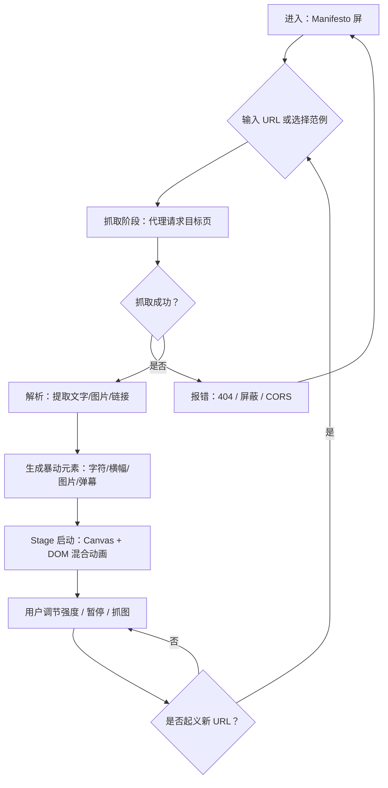

# PRD — 暴动 / Riot · 网页解构装置

## 1. 产品概述

一个受 Mark Napier 1999 年作品《Riot》启发的网络艺术装置：用户输入任意网址（百度、CNN、人民网……），系统抓取其内容（文字、图片、链接），将它们"暴动化"——文字被拆解为字符组成游行队伍，图片被涂鸦、撕裂、贴上标语，链接化为冲击波；整页变成一个混乱的抗议现场。

- 定位：单页交互艺术装置（gallery / portfolio / 浏览器中可运行的艺术品）
- 目标用户：网络艺术爱好者、媒体研究者、设计师、批评写作者
- 价值：以破坏性视觉语言重提"Web 阅读的政治性"，让熟悉的资讯页面陌生化、批判化

## 2. 核心功能

### 2.1 用户角色
本作品无需注册/登录，单一访客角色。

| 角色 | 入口 | 核心权限 |
|------|------|----------|
| 访客 | 直接打开站点 | 输入 URL、触发暴动、切换暴烈等级、分享作品 |

### 2.2 功能模块

1. **入口界面（Manifesto 屏）**：黑色油墨背景的"传单"风格落地页，输入框 + "Riot" 触发按钮 + 随机 URL 范例
2. **暴动舞台（Stage）**：抓取内容后渲染的抗议现场
3. **控制台（Command Bar）**：左上角细长控制条，可调节暴烈程度、清场、暂停、抓图
4. **侧边弹幕（Chant Stream）**：右侧贴边滚动的"口号流"，由原文高频词组成
5. **作品页脚（Colophon）**：底部暗藏的署名、版本号、灵感来源

### 2.3 页面细节

| 页面 | 模块 | 功能描述 |
|------|------|----------|
| 入口界面 | 标题区 | 巨型"RIOT"打字机效果标语，副标题为多语种翻译（暴动 / RİOT / 革命 / 起义） |
| 入口界面 | URL 输入框 | 黑色印刷体衬线字体，红/白 placeholder，敲击回车即起义 |
| 入口界面 | 范例标签 | 几个可点击的种子 URL：baidu.com / cnn.com / 人民网 / 新浪 / 404，故意包含乱码 |
| 暴动舞台 | 字符游行 | 抓取页面文本 → 按字符切分 → 组成行进队伍，跨屏水平移动，速度随强度变化 |
| 暴动舞台 | 涂鸦图像层 | 抓取图片 → 灰度+对比扭曲 → 错位旋转 → 叠加深红色"X"、抗议图标、stamp 印章 |
| 暴动舞台 | 撕裂横幅 | 长句被裁成 2-4 段纸条，从上往下坠落，末端带涂鸦涂鸦纸条 |
| 暴动舞台 | 抗议纸牌 | 单词级元素随机旋转抖动 -15°~+15°，模拟高举的标语牌 |
| 暴动舞台 | 烟雾层 | 顶端 Canvas 粒子，模拟催泪烟雾，鼠标移动会扰动粒子 |
| 控制台 | 强度滑块 | 1-5 档暴烈度（示威/推搡/冲突/暴动/巷战），控制密度、速度、颜色 |
| 控制台 | 暂停按钮 | 暂停所有动画，截图模式 |
| 控制台 | 抓图按钮 | 导出当前帧为 PNG |
| 控制台 | 重新起义 | 重新加载新 URL |
| 侧边弹幕 | 口号流 | 抓取文本的高频词 + 自带口号库（"不要温和地走进那个良夜"），竖向自下而上 |
| 页脚 | Colophon | 黑色小字：作者 / 灵感：Mark Napier "Riot" 1999 / 技术栈 |

## 3. 核心流程

用户流程：
1. 打开站点 → 看到黑色背景的传单，巨型"RIOT"标语缓慢闪烁
2. 在 URL 输入框敲入网址，或点击范例标签
3. 点击"起义" → 屏幕黑屏一瞬（"打碎玻璃"动画）→ 抓取中（"占领中…"进度涂鸦）
4. 抓取完成 → 暴动现场启动：字符列队、图像涂鸦、弹幕涌出
5. 用户可调节强度、暂停、抓图，或输入新网址再次起义
6. 任意时刻按 ESC → 返回入口屏

## 4. 用户界面设计

### 4.1 设计风格
- **整体调性**：油墨黑 + 警示红 + 报刊白（risograph/丝网印刷风格）
- **核心隐喻**：街头抗议、传单、贴纸、撕裂的报纸、催泪烟雾、印章、喷漆
- **配色**：
  - 主色 `#0a0a0a`（油墨黑）
  - 强调色 `#d72638`（警示红，抗议/血）
  - 辅助 `#f4f1de`（报刊白，背景与字）
  - 灰阶 `#2b2b2b` `#5c5c5c`（烟/影）
  - 偶尔闪过 `#ffd23f`（催泪黄）
- **字体**：
  - 标题：Permanent Marker / Anton / Bungee（手写涂鸦/印刷海报感）
  - 正文/标语：Special Elite / Cutive Mono（打字机/打字稿）
  - 中文：演示佛系体 + 思源宋体 Heavy
  - 数字/计数：Space Mono（用于强度、计时）
- **按钮/控件**：矩形硬边、无圆角、1px 实线描边、hover 时填充反色
- **布局**：打破栅格、文本层与图像层错位、Z 轴混乱
- **图标**：全部用 emoji 与手绘 SVG 印章风格（禁止线性图标库）
- **动效核心**：
  - 字符游行：水平匀速 + 周期抖动
  - 横幅坠落：重力 + 末端纸条自由旋转
  - 烟雾：Canvas 噪声粒子 + 鼠标扰动场
  - 进入转场：黑屏闪白 + 玻璃碎裂 glitch
  - 强度变化：整体速度、密度、颜色三轴同步插值

### 4.2 页面设计概述

| 页面 | 模块 | UI 元素 |
|------|------|---------|
| 入口 | 标题 | 屏幕中央 20vw 字号 "RIOT"，Bungee 字体，文字逐字闪入 |
| 入口 | 输入框 | 居中 60vw 宽黑底白边输入框，placeholder "www.example.com"，聚焦时红边 |
| 入口 | 范例 | 6 个黑底胶囊形标签，红色 1px 描边，hover 翻转 |
| 入口 | 印章 | 角落手绘风 "BURN THE FEED" 印章 SVG，缓慢旋转 |
| 暴动舞台 | 字符层 | 整屏字符列队，每个字符随机字体/大小/颜色/旋转 |
| 暴动舞台 | 图像层 | 原始图片以 8° 随机旋转、灰度、对比度 1.6 拉伸，叠 5 像素红 X |
| 暴动舞台 | 横幅层 | 长句切片从屏幕顶端坠落，触底继续滑行 |
| 暴动舞台 | 弹幕 | 右侧 4vw 宽竖条，自下而上滚动，字体 8-14px |
| 控制台 | 滑块 | 顶部细条 200×6 像素，刻度 1-5，当前档位以红点指示 |
| 控制台 | 按钮 | 60×24 像素方形小按钮，黑底白字，hover 反色 |
| 页脚 | Colophon | 屏幕底部居中 10px 灰字 "RIOT v0.1 — after Mark Napier, 1999" |

### 4.3 响应式
- Desktop-first，1440×900 为基线
- 1024-1440：等比缩放
- <1024：隐藏弹幕侧栏，强度滑块变为浮层
- 移动端：入口输入框变全宽，暴动舞台禁用部分粒子以保性能

### 4.4 视觉特效指导
- **环境氛围**：全屏油墨噪点纹理（filter: contrast + 颗粒），整体低饱和
- **光照/层叠**：图像层 + 文字层 + 弹幕层 + 烟雾层（4 个 z-index）
- **焦点**：中央偏上有一道"探照灯"高光（CSS 径向渐变），暗示镇压者视角
- **后处理**：CSS `mix-blend-mode: multiply` 让红 X 与图像混合；`filter: url(#displacement)` 做局部扭曲
- **素材来源**：全部为运行时生成（Canvas 噪声/几何），不依赖外部图库；emoji 来自系统字体
- **性能预算**：桌面 60fps，目标舞台元素数 ≤ 800，移动 ≤ 300
