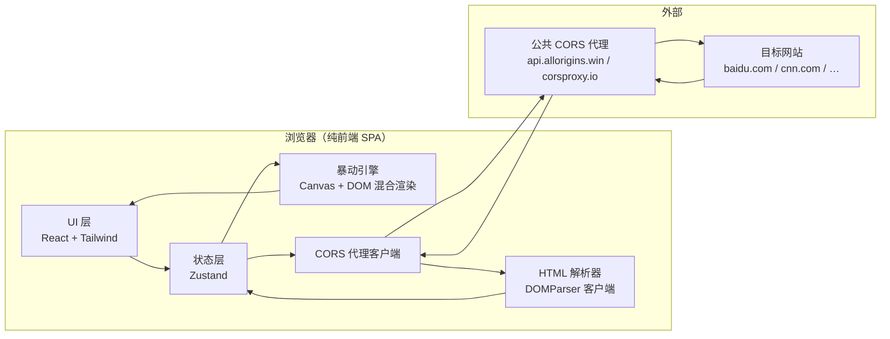

# 技术架构 — 暴动 / Riot · 网页解构装置

## 1. 架构设计

无后端纯前端 SPA。核心是"内容抓取 + 视觉再编码"，全部在浏览器端完成。



## 2. 技术选型

- **前端框架**：React 18 + TypeScript
- **构建工具**：Vite 5（`npm create vite@latest` 模板 `react-ts`）
- **样式**：Tailwind CSS v3（搭配少量原生 CSS 变量与 `@layer`）
- **状态管理**：Zustand（轻量、无样板）
- **动画**：CSS Animation + Canvas 2D 自行实现粒子；不引入 GSAP / framer-motion 以保可控
- **HTML 解析**：浏览器内置 `DOMParser`（对代理返回的 HTML 字符串做轻量清洗）
- **图片抓取**：`` + 抓取后绘制到 canvas 转 dataURL，再以 `mix-blend-mode` 处理；不可抓取的图用 `url()` 退回原图
- **CORS 代理**：默认 `https://api.allorigins.win/raw?url=`，可手动切换 `https://corsproxy.io/?`
- **截图导出**：`html2canvas` 体积过大 → 改用自实现"舞台离屏 canvas + dom-to-image-lite"或直接 `canvas.toDataURL` 组合
- **部署**：纯静态，构建产物托管在 Vercel / Netlify / 本地 `vite preview` 即可

## 3. 路由定义

单页，无路由库；状态机切换两个屏幕：

| 屏幕 | 内部状态名 | 用途 |
|------|------------|------|
| `manifesto` | 入口屏（黑底传单、URL 输入） |
| `stage` | 暴动舞台（抓取中 / 渲染中 / 抓取失败） |
| `colophon` | 底部页脚（始终可见，state=hidden 仅在 manifesto 全屏时折叠） |

## 4. API 定义

无后端，仅一个"抓取层"。封装为 `fetchViaProxy(url)` 工具：

```ts
// 抓取目标 URL 原始 HTML
async function fetchViaProxy(url: string): Promise<string>

// 抓取单张图片并转 dataURL
async function fetchImageAsDataURL(src: string): Promise<string | null>

// 解析 HTML，提取三组素材
interface RippedContent {
  title: string
  textChunks: string[]    // 句子级
  words: string[]         // 词级（去掉停用词）
  images: string[]        // 已转 dataURL 的图片
  links: string[]         // 链接文本
}

function ripContent(html: string, baseURL: string): RippedContent
```

错误码（前端自定义）：
- `E_PROXY` 代理不可达
- `E_PARSE` 解析失败
- `E_CORS_IMG` 图片跨域无法转 dataURL（仍用原 URL 退回）
- `E_EMPTY` 抓取后无可用素材

## 5. 模块结构

```
src/
├── main.tsx
├── App.tsx
├── index.css                    # Tailwind base + 全局 CSS 变量
├── state/
│   └── store.ts                 # Zustand: screen / intensity / content / status
├── screens/
│   ├── ManifestoScreen.tsx      # 入口屏
│   └── StageScreen.tsx          # 暴动舞台
├── riot/
│   ├── engine.ts                # 暴动引擎：主循环与元素生命周期
│   ├── layers/
│   │   ├── CharMarch.ts         # 字符游行
│   │   ├── BannerDrop.ts        # 横幅坠落
│   │   ├── PicketSign.ts        # 抗议纸牌（单词级）
│   │   ├── GraffitiImage.tsx    # 涂鸦图像层
│   │   ├── ChantStream.tsx      # 弹幕口号
│   │   └── SmokeCanvas.tsx      # 烟雾粒子（Canvas）
│   ├── fetch/
│   │   ├── proxy.ts
│   │   ├── parse.ts
│   │   └── image.ts
│   └── utils/
│       ├── rng.ts               # 种子随机（Mulberry32）
│       └── text.ts              # 切词、清洗
├── ui/
│   ├── CommandBar.tsx           # 顶部控制台
│   ├── IntensitySlider.tsx
│   ├── Stamp.tsx                # 印章 SVG
│   └── Glitch.tsx               # 字体逐字闪入
└── types.ts
```

## 6. 数据模型

无数据库，无持久化。所有状态为运行时内存态，仅 LocalStorage 缓存最近一次 URL 以便回车自动填入。

```ts
type Screen = 'manifesto' | 'stage'
type Intensity = 1 | 2 | 3 | 4 | 5   // 示威/推搡/冲突/暴动/巷战
type StageStatus = 'idle' | 'fetching' | 'parsing' | 'revolting' | 'error'

interface RiotState {
  screen: Screen
  intensity: Intensity
  status: StageStatus
  target: string
  content: RippedContent | null
  paused: boolean
  // 操作
  ignite(url: string): Promise<void>
  setIntensity(i: Intensity): void
  togglePause(): void
  reset(): void
}
```

## 7. 关键实现要点

### 7.1 CORS 与抓取
- 直接 fetch 目标 URL 必然被浏览器拦截，必须经代理
- 代理选 `allorigins.win/raw?url=`（返回纯文本，最适合 DOMParser）
- 对图片：`` 加载后用 canvas `toDataURL` 转码，失败回退原 `src`

### 7.2 内容切分策略
- 文本：`textChunks` 按段落与句号切，每段 30-120 字符
- 词级：`words` 提取 `[a-zA-Z\u4e00-\u9fa5]{2,}`，过滤停用词（top 100 英文 + 常见中文虚词）
- 图片：过滤 `width<80 || height<80`、过滤 `display:none` 祖先、过滤纯装饰 `alt=""` 且非 PNG/JPG
- 链接：取 `a[href]` 内的可见文本

### 7.3 暴动引擎
- 主循环用 `requestAnimationFrame`
- 每个元素是一个对象 `{kind, x, y, vx, vy, life, payload}`，每帧更新位置/生命
- 强度变化时调整：粒子数（密度）、速度倍率、颜色权重
- 字符游行：在屏幕内开 N 条"街道"（y 固定），字符从右向左流动
- 横幅坠落：每条横幅一个 `transform: translate + rotate`，触底后变为水平滑行
- 烟雾：纯 Canvas 2D，~150 颗粒子，鼠标移动产生斥力场
- 帧率高但元素数大时，使用 `transform` 与 `will-change: transform` 而非改 `left/top`

### 7.4 字体加载
- 用 `fontsource` 子集化打包 `Bungee` `Permanent Marker` `Special Elite` `Space Mono` `Noto Serif SC`（中文）
- Tailwind `font-display: swap`，首屏 fallback 走 `serif`

### 7.5 截图
- 舞台根节点加 `data-riot-stage`
- 用 `html-to-image`（轻量）一次性导出 PNG，文件名 `riot-<host>-<timestamp>.png`

### 7.6 性能预算
- 单舞台 ≤ 800 活动元素；超出按"最近 800"裁剪
- 移动端检测 `navigator.maxTouchPoints>0 && innerWidth<768` 时降级：禁弹幕、关烟雾

## 8. 构建与运行

```bash
npm install
npm run dev          # 本地开发 http://localhost:5173
npm run build        # 生产构建到 dist/
npm run preview      # 预览生产产物
```

依赖（运行期）：
- react, react-dom
- zustand
- html-to-image

依赖（开发期）：
- vite, @vitejs/plugin-react
- typescript
- tailwindcss, postcss, autoprefixer
- @fontsource/bungee, @fontsource/permanent-marker, @fontsource/special-elite, @fontsource/space-mono, @fontsource/noto-serif-sc
